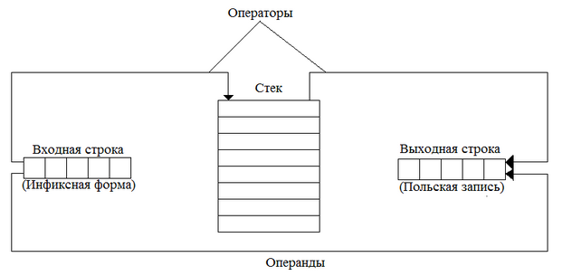
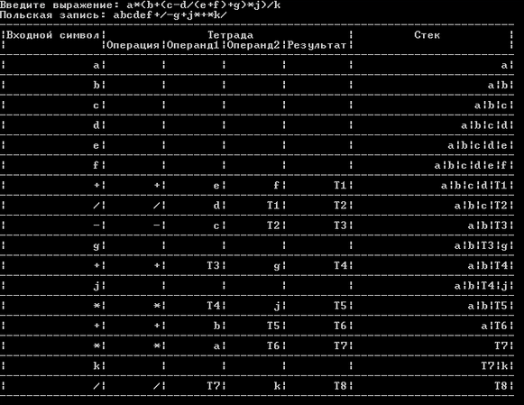

# Polska

Формирование списка тетрад по инфиксной форме.

## Введение

Формальный язык – это знаковая система для описания и обмена информации между людьми, человеком и ЭВМ, различными автоматическими устройствами.

Основой любого формального языка является алфавит – набор допустимых в языке элементарных знаков, также называемых литерами.
    
Трансляция прикладной программы с исходного языка на объектный, в общем случае, состоит в изменении алфавита, лексики и синтаксиса языка программы с сохранением ее семантики. Процесс трансляции разбивается на несколько фаз:

1. Лексический анализ;
2. Синтаксический анализ;
3. Семантический анализ;
4. Синтез объектной программы.

Внутреннее представление программы в значительной степени зависит от его дальнейшего использования. Это может быть дерево, отражающее синтаксис или семантику исходной
программы, так называемая польская запись или список тетрад вида:

`(оператор, операнд, операнд, результат)`.

Цель данной программы заключается в представлении исходного выражения в инфиксной форме в виде списка тетрад.

## Постановка задачи

Синтез объектной программы начинается, как правило, с распределения и выделения памяти для основных программных объектов. Затем в компиляторах производится перевод внутреннего представления
исходной программы в семантически эквивалентную объектную программу на машинном языке или языке ассемблера. Анализ внутреннего представления позволяет задать последовательность генерируемых
команд объектной программы, а вся необходимая семантическая информация выбирается из таблиц транслятора. В частности, по таблице символов определяются типы команд, которые допустимы для операндов,
используемых в генерируемых командах. В интерпретаторе эта часть транслятора заменяется программой, которая фактически выполняет внутреннее представление исходной программы.

Одним из важных моментов при синтезе объектного кода является оптимизация программы с целью уменьшения времени ее выполнения или объема занимаемой при этом памяти. Оптимизация может выполняться как
над внутренним представлением исходной программы, так и над объектной программой на машинном языке или языке ассемблера. Соответствующие фазы также могут включаться в процесс трансляции и обычно называются
фазами машинно-независимой и машинно-зависимой оптимизации соответственно.

Инфиксная нотация — это форма записи математических и логических формул, в которой операторы записаны в инфиксном стиле между операндами на которые они воздействуют (Например, 2 + 2).
Задача разбора выражений, записанных в такой форме для компьютера сложнее по сравнению с префиксной (то есть + 2 2) или постфиксной (2 2 +). Однако эта запись используется в большинстве языков
программирования как более естественная для человека.

В инфиксной нотации, в отличие от префиксной и постфиксной, скобки, окружающие группы операндов и операторов, определяют порядок в котором будут выполнены
операции. При отсутствии скобок операции выполняются согласно правилам приоритета операторов.

Отличительной особенностью польской нотации является то, что все аргументы (или операнды) расположены перед знаком
операции. В общем виде запись выглядит следующим образом:

1. Запись набора операций состоит из последовательности операндов и знаков операций. Операнды в выражении при письменной записи разделяются пробелами.
2. Выражение читается слева направо. Когда в выражении встречается знак операции, выполняется соответствующая операция над двумя последними встретившимися перед ним операндами в порядке их записи. Результат операции заменяет в выражении последовательность её операндов и её знак, после чего выражение вычисляется дальше по тому же правилу.
3. Результатом вычисления выражения становится результат последней вычисленной операции.

В основе алгоритма получения польской записи лежит схема обработки данных, представленная на рисунке:

Входная строка анализируется слева направо по элементам (лексемам), операнды переносятся в выходную строку без действия над ними, операторы сохраняются в стеке с
целью учета их приоритета, при этом при записи операторов в стек они могут "вытолкнуть" из стека другие операторы, которые записываются в выходную строку.
Таблица приоритетов операторов, используемых при работе со стеком показана в таблице:

| Операторы            | Приоритет |
|----------------------|-----------|
| (, [, {              | 0         |
| ИЛИ                  | 1         |
| И                    | 2         |
| НЕ                   | 3         |
| <, ≤, =, ≠, ≥, >     | 4         |
| *, /                 | 5         |
| #ERROR!              | 6         |
| Возведение в степень | 7         |
| Изменение знака      | 8         |

Детально работа со стеком заключается в следующем:

1. Если текущий считанный элемент имеет больший приоритет, чем оператор в вершине стека, то он записывается в стек, иначе из стека последовательно извлекаются и переносятся в выходную строку операторы с большим приоритетом или равным приоритету, затем текущий оператор сохраняется в стеке.
2. Левая скобка всегда записывается в стек без учета приоритета.
3. Правая скобка никогда не записывается в стек, но "выталкиваются" в выходную строку все операторы до ближайшей левой скобки включительно, левая скобка в выходную строку не записывается. Т.е. можно считать пара скобок одного типа уничтожают друг друга.
4. После завершения чтения выходной строки в стеке могут остаться операторы, они последовательно переносятся в выходную строку.

Список тетрад и работа со стеком для выражения a + b * c представлена в таблице:

| Входной символ | Тетрада  | Тетрада  | Тетрада  | Тетрада   | Стек  |
|----------------|----------|----------|----------|-----------|-------|
|                | Операция | Операнд1 | Операнд2 | Результат |       |
| a              |          |          |          |           | a     |
| b              |          |          |          |           | a b   |
| c              |          |          |          |           | a b c |
| *              | *        | b        | c        | T1        | a T1  |
| +              | +        | a        | T1       | T2        | T2    |

Где T1 и T2 – временные переменные, образованные транслятором.

## Пример работы программы

В качестве контрольного примера возьмем выражение:

`a * (b + (c – d / (e + f) + g) * j) / k`

