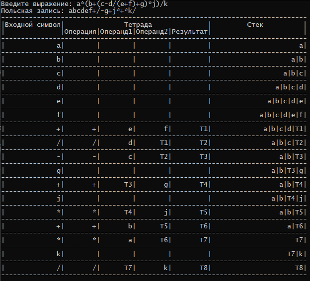
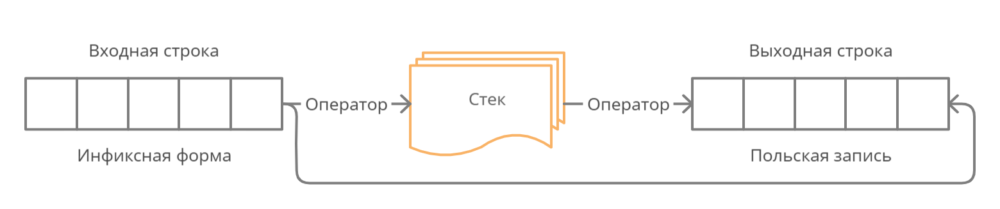

# 💻 Polska

💻 ➕ Программа «Polska», написанная в рамках курсового проекта, для представления выражения в инфиксной форме в виде польской записи и списка тетрад:

`(оператор, операнд, операнд, результат)`

## 📄 Описание

**Инфиксная нотация** — это форма записи математических и логических формул, в которой операторы записаны в инфиксном стиле между операндами на которые они воздействуют (например, `2 + 2`).

**Польская нотация**, также известна как **префиксная нотация** (запись) — это форма записи логических, арифметических и алгебраических выражений. Характерная черта такой записи — оператор располагается слева от операндов (например, `+ 3 4`).

### 💻 Работа программы

В качестве примера возьмем выражение:

`a * (b + (c – d / (e + f) + g) * j) / k`

Для получения польской записи и списка тетрад необходимо:

1. Ввести выражение в программу;
2. Нажать клавишу `Enter`.

Результат работы программы представлен на рисунке:

### 💡 Алгоритм

В основе алгоритма получения польской записи лежит схема обработки данных, представленная на рисунке:

Входная строка анализируется слева направо по элементам (лексемам), операнды переносятся в выходную строку без действия над ними, операторы сохраняются в стеке с
целью учета их приоритета, при этом при записи операторов в стек они могут "вытолкнуть" из стека другие операторы, которые записываются в выходную строку.

Таблица приоритетов операторов, используемых при работе со стеком показана в таблице:

| Операторы            | Приоритет |
|----------------------|-----------|
| (, [, {              | 0         |
| ИЛИ                  | 1         |
| И                    | 2         |
| НЕ                   | 3         |
| <, ≤, =, ≠, ≥, >     | 4         |
| *, /                 | 5         |
| +, -                 | 6         |
| Возведение в степень | 7         |
| Изменение знака      | 8         |

Детально работа со стеком заключается в следующем:

1. Если текущий считанный элемент имеет больший приоритет, чем оператор в вершине стека, то он записывается в стек, иначе из стека последовательно извлекаются и переносятся в выходную строку операторы с большим приоритетом или равным приоритету, затем текущий оператор сохраняется в стеке;
2. Левая скобка всегда записывается в стек без учета приоритета;
3. Правая скобка никогда не записывается в стек, но "выталкиваются" в выходную строку все операторы до ближайшей левой скобки включительно, левая скобка в выходную строку не записывается. Т.е. можно считать пара скобок одного типа уничтожают друг друга;
4. После завершения чтения выходной строки в стеке могут остаться операторы, они последовательно переносятся в выходную строку.

Список тетрад и работа со стеком для выражения `a + b * c` представлена в таблице:

| Входной символ | Тетрада  | Тетрада  | Тетрада  | Тетрада   | Стек        |
|----------------|----------|----------|----------|-----------|-------------|
|                | Операция | Операнд1 | Операнд2 | Результат |             |
| a              |          |          |          |           | a           |
| b              |          |          |          |           | a \| b      |
| c              |          |          |          |           | a \| b \| c |
| *              | *        | b        | c        | T1        | a \| T1     |
| +              | +        | a        | T1       | T2        | T2          |

Где **T1** и **T2** — временные переменные, образованные транслятором.

## 🔧 Техническая часть

### 💿 Установка

1. В [releases](https://github.com/snikitin-de/Polska/releases) скачать архив с последней версии программы;
2. Распаковать архив.

### 💾Использование

Для выполнения программы необходимо запустить **Polska.exe** из распакованного архива.

После запуска программы необходимо ввести выражение для которого будет сформирована польская запись и список тетрад.
